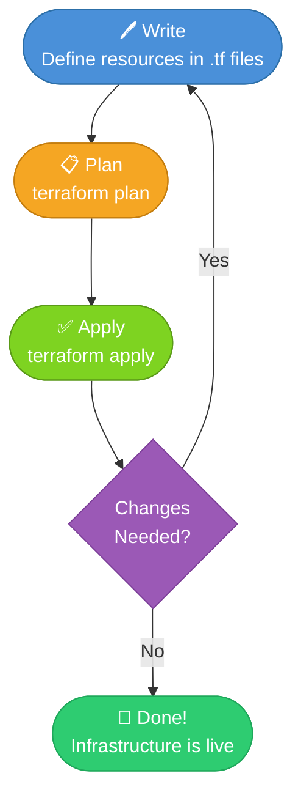

# 🚀 Mastering Terraform: From Zero to Windows Deployment

> **Audience:** Students & Early-Career Engineers | **Level:** Beginner → Intermediate  
> **Prerequisites:** Basic command-line familiarity, an AWS or Azure account (for Level 2)

---

## Table of Contents

1. [What is Infrastructure as Code?](#1-what-is-infrastructure-as-code)
2. [The Terraform Lifecycle](#2-the-terraform-lifecycle)
3. [Windows Installation Guide](#3-windows-installation-guide)
4. [Terraform vs. Manual Infrastructure](#4-terraform-vs-manual-infrastructure-summary-table)
5. [Lab Exercise — Level 1: The Basics](#5-lab-exercise--level-1-the-basics)
6. [Lab Exercise — Level 2: Cloud Resources](#6-lab-exercise--level-2-cloud-resources)
7. [Lab Exercise — Level 3: Logic & Variables](#7-lab-exercise--level-3-logic--variables)
8. [Next Steps](#8-next-steps)

---

## 1. What is Infrastructure as Code?

**Infrastructure as Code (IaC)** is the practice of managing and provisioning computing infrastructure — servers, networks, databases, storage — through machine-readable configuration files rather than through manual processes or interactive configuration tools.

Think of it this way: just as a developer writes code to define application logic, a cloud engineer writes code to define *infrastructure* logic. That code can be versioned in Git, reviewed in pull requests, tested in pipelines, and deployed repeatably across dozens of environments.

### Why IaC Matters

Before IaC, a team might provision a server by logging into a cloud console, clicking through menus, and hoping someone documented the steps. If the server failed, recreating it was a multi-hour manual process riddled with human error. IaC solves this by making infrastructure **declarative**, **reproducible**, and **auditable**.

**Terraform**, created by HashiCorp, is the most widely adopted IaC tool in the industry. It uses its own domain-specific language called **HCL (HashiCorp Configuration Language)**, which is designed to be human-readable while remaining machine-parseable. Terraform is **cloud-agnostic** — the same workflow manages resources on AWS, Azure, GCP, and hundreds of other providers.

---

## 2. The Terraform Lifecycle

Terraform follows a simple three-phase lifecycle that you will run every time you make infrastructure changes.



### Phase 1 — Write 🖊️

You author `.tf` configuration files that describe *what* you want — not *how* to create it. For example: "I want an S3 bucket named `my-app-assets` in `us-east-1`." Terraform figures out the API calls required.

### Phase 2 — Plan 📋

Running `terraform plan` causes Terraform to:
1. Read your `.tf` files.
2. Compare the desired state against the **current state** (tracked in `terraform.tfstate`).
3. Print a human-readable execution plan showing exactly what will be **created**, **modified**, or **destroyed**.

No changes are made during this phase. It is purely a preview — your safety net.

### Phase 3 — Apply ✅

Running `terraform apply` executes the plan. Terraform calls the relevant provider APIs (AWS, Azure, etc.) to make your infrastructure match the desired configuration. The state file is then updated to reflect the new reality.

> **💡 Pro-Tip:** Always review `terraform plan` output carefully before applying. Look for any unexpected `destroy` actions, which could indicate a misconfiguration. In CI/CD pipelines, save the plan output with `terraform plan -out=tfplan` and apply it deterministically with `terraform apply tfplan`.

---

## 3. Windows Installation Guide

### Step 1 — Download the Terraform Binary

1. Open your browser and navigate to the official Terraform releases page:  
   **https://developer.hashicorp.com/terraform/install**

2. Under the **Windows** tab, click the **AMD64** download link (this is the correct version for virtually all modern Windows machines).

3. You will download a `.zip` file such as `terraform_1.x.x_windows_amd64.zip`.

### Step 2 — Extract the Binary

1. Right-click the downloaded `.zip` file and select **Extract All…**
2. Extract to a permanent, clean location. A recommended path is:

   ```
   C:\Tools\Terraform\
   ```

3. After extraction, confirm the folder contains a single file: `terraform.exe`

> **⚠️ Common Student Error:** Do not extract `terraform.exe` to your Downloads folder or Desktop. These are temporary locations. If you move the file later, your PATH variable will break and Terraform will stop working.

### Step 3 — Add Terraform to the System PATH

The PATH environment variable tells Windows where to look for executable programs. Adding Terraform's directory to the PATH lets you run `terraform` from any folder in PowerShell or Command Prompt.

**Method A: Using the GUI (Recommended for Beginners)**

1. Press `Win + S`, search for **"Environment Variables"**, and click **"Edit the system environment variables"**.
2. In the **System Properties** window, click **"Environment Variables…"**
3. Under **"System variables"**, find and select the variable named **`Path`**, then click **"Edit…"**
4. Click **"New"** and paste your Terraform path:
   ```
   C:\Tools\Terraform
   ```
5. Click **OK** → **OK** → **OK** to save all dialogs.

**Method B: Using PowerShell (Quick & Scriptable)**

Open PowerShell **as Administrator** and run:

```powershell
# Append Terraform directory to the Machine-level PATH permanently
$terraformPath = "C:\Tools\Terraform"
$currentPath   = [System.Environment]::GetEnvironmentVariable("Path", "Machine")

if ($currentPath -notlike "*$terraformPath*") {
    [System.Environment]::SetEnvironmentVariable(
        "Path",
        "$currentPath;$terraformPath",
        "Machine"
    )
    Write-Host "✅ Terraform path added successfully." -ForegroundColor Green
} else {
    Write-Host "ℹ️  Terraform path already exists in PATH." -ForegroundColor Yellow
}
```

> **⚠️ Common Student Error:** Changes to the System PATH do **not** take effect in already-open PowerShell windows. After modifying the PATH, **close and reopen PowerShell** before testing.

### Step 4 — Verify the Installation

Open a **new** PowerShell window and run:

```powershell
terraform --version
```

**Expected output:**

```
Terraform v1.9.x
on windows_amd64
```

If you see `The term 'terraform' is not recognized`, revisit Step 3 and confirm the correct path was added. Also ensure you opened a *new* PowerShell session.

> **💡 Pro-Tip:** Run `terraform -help` to see a full list of available commands. Bookmark the [Terraform CLI documentation](https://developer.hashicorp.com/terraform/cli) — you will reference it constantly.

---

## 4. Terraform vs. Manual Infrastructure — Summary Table

| Dimension | Manual (ClickOps) | Terraform (IaC) |
|---|---|---|
| **Speed** | Slow — requires GUI navigation | Fast — one command deploys everything |
| **Repeatability** | Inconsistent — human error is common | Deterministic — identical output every run |
| **Version Control** | Not possible — no code to track | Full Git history, branching, and PRs |
| **Disaster Recovery** | Recreating takes hours of documentation-hunting | Re-run `terraform apply` — done in minutes |
| **Auditability** | Who changed what? Unknown. | Every change is a commit with author & timestamp |
| **Multi-Environment** | Manually duplicate every step for dev/staging/prod | Reuse modules with different variable files |
| **Team Collaboration** | Risky — two people can conflict in the console | Managed via state locking and remote backends |
| **Learning Curve** | Low initial, high long-term pain | Moderate initial investment, massive long-term gain |
| **Cost Visibility** | Requires separate tooling | `terraform plan` can integrate with cost estimation tools |

---

## 5. Lab Exercise — Level 1: The Basics

**Objective:** Use the `local` provider to create a text file on your computer. No cloud account required.

**Skills practiced:** Provider configuration, `resource` blocks, `terraform init`, `terraform apply`, `terraform destroy`.

### Project Setup

Create a new folder for this lab and open it in PowerShell:

```powershell
New-Item -ItemType Directory -Path "$HOME\terraform-labs\level-1"
Set-Location "$HOME\terraform-labs\level-1"
```

### Configuration File

Create a file named `main.tf` with the following content:

```hcl
# main.tf — Level 1: Local File Provider

# The 'terraform' block declares required providers.
terraform {
  required_providers {
    local = {
      source  = "hashicorp/local"
      version = "~> 2.4"
    }
  }
}

# The 'local_file' resource creates a file on the local filesystem.
resource "local_file" "my_first_file" {
  filename = "${path.module}/hello_terraform.txt"
  content  = "Hello from Terraform! This file was created automatically."
}
```

### Run the Workflow

```powershell
# Step 1: Initialize — downloads the 'local' provider plugin
terraform init

# Step 2: Preview the plan
terraform plan

# Step 3: Apply — creates hello_terraform.txt
terraform apply
# When prompted, type 'yes' and press Enter

# Verify the file was created
Get-Content .\hello_terraform.txt

# Step 4: Destroy — removes all resources managed by this config
terraform destroy
```

> **💡 Pro-Tip:** Notice that after `terraform apply`, a `terraform.tfstate` file appears in your directory. This JSON file is Terraform's memory — it maps your configuration to real-world resources. Never manually edit this file, and never delete it while you have live infrastructure.

> **⚠️ Common Student Error:** Running `terraform apply` a second time without making any changes will show **"No changes. Infrastructure is up-to-date."** This is Terraform's idempotency in action — it won't recreate a resource that already matches the desired state.

---

## 6. Lab Exercise — Level 2: Cloud Resources

**Objective:** Provision a real cloud resource — an **AWS S3 bucket** — using Terraform.

**Prerequisites:** AWS CLI installed and configured (`aws configure`) with valid credentials.

### Project Setup

```powershell
New-Item -ItemType Directory -Path "$HOME\terraform-labs\level-2"
Set-Location "$HOME\terraform-labs\level-2"
```

### Configuration File

```hcl
# main.tf — Level 2: AWS S3 Bucket

terraform {
  required_providers {
    aws = {
      source  = "hashicorp/aws"
      version = "~> 5.0"
    }
  }
}

# Configure the AWS provider with your target region.
provider "aws" {
  region = "us-east-1"
}

# Create a private S3 bucket with a unique name.
resource "aws_s3_bucket" "student_bucket" {
  # S3 bucket names must be globally unique across all AWS accounts.
  # Replace 'yourname' with something unique to you.
  bucket = "terraform-lab-yourname-2024"

  tags = {
    Name        = "TerraformStudentLab"
    Environment = "Learning"
    ManagedBy   = "Terraform"
  }
}

# Block all public access to the bucket (security best practice).
resource "aws_s3_bucket_public_access_block" "student_bucket_pab" {
  bucket = aws_s3_bucket.student_bucket.id

  block_public_acls       = true
  block_public_policy     = true
  ignore_public_acls      = true
  restrict_public_buckets = true
}
```

### Run the Workflow

```powershell
# Initialize — downloads the AWS provider (~50MB, takes a moment)
terraform init

# Plan — review what Terraform will create
terraform plan

# Apply — creates the S3 bucket in your AWS account
terraform apply
# Type 'yes' when prompted

# Verify in the AWS Console or via CLI:
aws s3 ls | Select-String "terraform-lab"

# IMPORTANT: Always destroy lab resources when finished to avoid charges!
terraform destroy
```

> **💡 Pro-Tip:** Use the `tags` attribute on every AWS resource. Tags are essential for cost allocation, resource identification, and access control policies. Make it a habit from day one.

> **⚠️ Common Student Error:** S3 bucket names are **globally unique** across all AWS accounts worldwide. If you use a generic name like `my-terraform-bucket`, the apply will fail with a `BucketAlreadyExists` error. Include your name, a date, or a random suffix in the bucket name.

---

## 7. Lab Exercise — Level 3: Logic & Variables

**Objective:** Refactor a configuration to use `variables.tf` and `outputs.tf`, demonstrating modularity, reusability, and clean code organization.

**Why this matters:** Hardcoding values (like region, environment name, or resource sizes) into `main.tf` makes your configuration inflexible. Variables let you deploy the same code to multiple environments simply by changing a values file.

### Project Structure

```
level-3/
├── main.tf          # Resource definitions
├── variables.tf     # Input variable declarations
├── outputs.tf       # Output value declarations
└── terraform.tfvars # Actual variable values (like a .env file)
```

```powershell
New-Item -ItemType Directory -Path "$HOME\terraform-labs\level-3"
Set-Location "$HOME\terraform-labs\level-3"
```

### `variables.tf`

```hcl
# variables.tf — Declares all input variables for this module.

variable "aws_region" {
  description = "The AWS region where resources will be deployed."
  type        = string
  default     = "us-east-1"
}

variable "environment" {
  description = "The deployment environment (dev, staging, prod)."
  type        = string
  default     = "dev"

  validation {
    condition     = contains(["dev", "staging", "prod"], var.environment)
    error_message = "Environment must be one of: dev, staging, prod."
  }
}

variable "bucket_name_prefix" {
  description = "A prefix for the S3 bucket name. Must be lowercase and hyphen-separated."
  type        = string
}

variable "common_tags" {
  description = "A map of tags to apply to all resources."
  type        = map(string)
  default = {
    ManagedBy = "Terraform"
    Project   = "StudentLab"
  }
}
```

### `main.tf`

```hcl
# main.tf — Resource definitions using input variables.

terraform {
  required_providers {
    aws = {
      source  = "hashicorp/aws"
      version = "~> 5.0"
    }
  }
}

provider "aws" {
  region = var.aws_region
}

locals {
  # Compose a unique bucket name using the prefix and environment variable.
  bucket_name = "${var.bucket_name_prefix}-${var.environment}-assets"

  # Merge common tags with resource-specific tags.
  resource_tags = merge(var.common_tags, {
    Environment = var.environment
  })
}

resource "aws_s3_bucket" "app_assets" {
  bucket = local.bucket_name
  tags   = local.resource_tags
}

resource "aws_s3_bucket_public_access_block" "app_assets_pab" {
  bucket                  = aws_s3_bucket.app_assets.id
  block_public_acls       = true
  block_public_policy     = true
  ignore_public_acls      = true
  restrict_public_buckets = true
}
```

### `outputs.tf`

```hcl
# outputs.tf — Declares values to display after 'terraform apply'.
# Outputs are also used to share values between modules.

output "bucket_name" {
  description = "The name of the S3 bucket that was created."
  value       = aws_s3_bucket.app_assets.bucket
}

output "bucket_arn" {
  description = "The Amazon Resource Name (ARN) of the bucket."
  value       = aws_s3_bucket.app_assets.arn
}

output "bucket_region" {
  description = "The AWS region where the bucket was created."
  value       = aws_s3_bucket.app_assets.region
}

output "environment" {
  description = "The environment this bucket belongs to."
  value       = var.environment
}
```

### `terraform.tfvars`

```hcl
# terraform.tfvars — Provide actual values for your variables.
# This file is like a .env file. Do NOT commit it to Git if it contains secrets!

bucket_name_prefix = "myapp-yourname"
environment        = "dev"
aws_region         = "us-east-1"

common_tags = {
  ManagedBy = "Terraform"
  Project   = "StudentLab"
  Owner     = "your.email@example.com"
}
```

### Run the Workflow

```powershell
terraform init
terraform plan
terraform apply

# After apply, Terraform will print your declared outputs:
# Outputs:
#   bucket_arn    = "arn:aws:s3:::myapp-yourname-dev-assets"
#   bucket_name   = "myapp-yourname-dev-assets"
#   bucket_region = "us-east-1"
#   environment   = "dev"

# Deploy to a different environment without changing any .tf files:
terraform apply -var="environment=staging"

# Clean up
terraform destroy
```

> **💡 Pro-Tip:** The `validation` block inside a variable declaration is a powerful pattern. It catches bad inputs *before* Terraform makes any API calls, giving your teammates a clear, immediate error message rather than a cryptic cloud provider error returned after 30 seconds of waiting.

> **⚠️ Common Student Error:** Never commit `terraform.tfvars` or `*.tfstate` files to a public Git repository. The `.tfvars` file can contain sensitive values (API keys, passwords), and the state file can expose the full configuration of your infrastructure. Add both to your `.gitignore`:
>
> ```
> *.tfvars
> *.tfstate
> *.tfstate.backup
> .terraform/
> ```

---

## 8. Next Steps

Congratulations on completing all three levels! Here is a structured path to continue your Terraform journey:

**Immediate Next Steps**
- Explore **Terraform Modules** — reusable, shareable packages of Terraform configuration. The [Terraform Registry](https://registry.terraform.io) hosts thousands of community modules.
- Learn about **Remote State Backends** (S3 + DynamoDB for AWS, Azure Blob Storage) to safely store your state file and enable team collaboration with state locking.
- Practice **`terraform import`** to bring existing manually-created resources under Terraform management.

**Intermediate Topics**
- **Workspaces** — manage multiple environments (dev/staging/prod) from a single configuration directory.
- **`for_each` and `count`** meta-arguments — create multiple similar resources dynamically.
- **`data` sources** — query existing infrastructure to use as inputs (e.g., look up the latest AWS AMI ID automatically).

**Advanced Topics**
- **Terragrunt** — a thin wrapper around Terraform that adds DRY (Don't Repeat Yourself) principles for large-scale deployments.
- **CI/CD Integration** — automate `plan` and `apply` in GitHub Actions, GitLab CI, or Azure DevOps pipelines.
- **Policy as Code** with **Sentinel** or **Open Policy Agent (OPA)** — enforce governance rules on your Terraform plans.

**Certification**
Consider the **HashiCorp Certified: Terraform Associate** exam to validate your skills formally. The official study guide and practice exams are available at [developer.hashicorp.com/certifications](https://developer.hashicorp.com/certifications).

---

*Guide authored for educational use. Always refer to the [official Terraform documentation](https://developer.hashicorp.com/terraform/docs) for the most current information. Provider APIs and Terraform syntax evolve across versions.*
